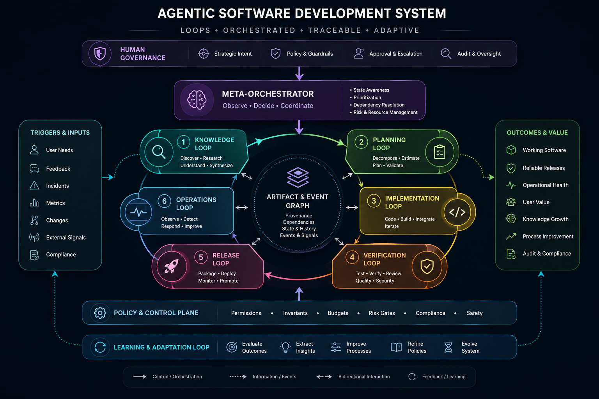

# Acme Software Factory

Acme Software Factory is a local-first development testbed made from independent products that cover identity, organizational knowledge, project inception, agent-driven implementation, issue and review management, and feature exploration.

This repository is the suite entrypoint. It contains the shared launcher and pins compatible versions of each product as a Git submodule. Every subproject keeps its own repository, history, releases, and standalone development workflow.



The diagram is the broader direction, not a claim that every loop is automated today. The current suite focuses on inspectable local workflows with explicit human handoffs.

## Repository structure

| Path | Default port | Intent |
|---|---:|---|
| [`acme-identity`](https://github.com/eimg/acme-identity) | 8316 | Thin suite identity provider: users, sessions, capability roles, and scoped service tokens. |
| [`primer`](https://github.com/eimg/primer) | 8317 | Independent knowledge system for authorized retrieval, inspectable evidence, and cited answers. |
| [`prelude`](https://github.com/eimg/prelude) | 8318 | Independent project-inception workspace that produces bootstrap artifacts for a new codebase. |
| [`helix`](https://github.com/eimg/helix) | 8319 | Independent agent workflow and PR-control plane. It runs inside a target repository. |
| [`acme-issues`](https://github.com/eimg/acme-issues) | 8320 | Local issue, implementation handoff, pull-request evidence, and human merge surface. |
| [`acme-projects`](https://github.com/eimg/acme-projects) | 8321 | Local feature-exploration board that hands ready work to Acme Issues. |
| [`acme-obs`](https://github.com/eimg/acme-obs) | 8322 | Optional read-only operational view across suite workflows and source health. |
| [`acme-todo`](https://github.com/eimg/acme-todo) | 8331 | Disposable target application used to exercise Helix and the surrounding workflow. |

The products are deliberately not one application. Primer, Prelude, and Helix remain useful without the Acme suite. Their integrations use replaceable HTTP/auth seams rather than imports from sibling repositories. The `acme-*` services provide local alternatives to external identity, project, and issue platforms and may integrate more closely.

## Current workflow boundaries

There are two related paths:

1. **New project:** optional Primer evidence → Prelude inception → exported bootstrap → Helix creates and initializes a target workspace.
2. **Existing project:** Acme Projects exploration → deliberate Acme Issues handoff → Helix implementation in the target repository → independent review evidence → human merge.

Acme Identity is cross-cutting rather than another step in either path. It supplies shared human sessions and narrowly scoped machine credentials when suite authentication is enabled. Acme Observability is also cross-cutting and optional: it pulls allowlisted operational facts without becoming a workflow dependency or source of truth.

Acme Projects does not call Helix directly. A ready card creates a non-triggering Acme Issues issue; a human starts implementation through the configured Issues trigger. Helix reports lifecycle and review evidence back through the service boundaries.

## Clone the complete suite

Clone recursively so Git checks out the commit of every subproject pinned by this repository:

```bash
git clone --recurse-submodules https://github.com/eimg/acme-software-factory.git
cd acme-software-factory
```

If the repository was cloned without submodules, initialize them afterward:

```bash
git submodule update --init --recursive
```

After pulling a newer suite commit, synchronize its pinned subproject versions:

```bash
git pull --recurse-submodules
git submodule update --init --recursive
```

The root repository pins exact commits for reproducible integration. It does not automatically follow the newest `main` of every child repository.

## Install dependencies

Requirements:

- Node.js 22.19 or newer (Node.js 24 LTS is supported)
- npm
- `curl` and `pgrep` for the suite launcher

Install each product independently:

```bash
for project in acme-identity primer prelude helix acme-issues acme-projects acme-obs acme-todo; do
  npm --prefix "$project" install
done
```

Each subproject README documents its standalone modes, provider configuration, data, and verification commands.

## Start the local services

Run the root launcher:

```bash
./start-acme.sh
```

On an interactive terminal it offers two modes:

- **Off** — seamless feature testing with development-admin access and no sign-in.
- **Local** — Acme Identity sign-in, permission checks, and scoped service-token enforcement.

The launcher starts services in dependency order and waits for each health check:

```text
Identity 8316 → Primer 8317 → Prelude 8318 → Issues 8320 → Projects 8321 → Observability 8322
```

Press `Ctrl-C` to stop every service started by the script. For automation, bypass the menu explicitly:

```bash
ACME_AUTH_MODE=off ./start-acme.sh
ACME_AUTH_MODE=local ./start-acme.sh
```

Before the first local-auth run, provision the suite's scoped machine credentials:

```bash
./start-acme.sh --provision-auth
```

In an interactive local-mode start, the launcher also detects missing credentials and offers to provision them. Non-interactive local startup fails early with the provisioning command when credentials are missing. Ordinary startup never rotates valid tokens; use `--provision-auth` deliberately when credentials expire, are revoked, or need rotation.

The provisioner writes tokens only to ignored local environment files in their intended consumers. It rotates all suite service tokens, so run it before starting services and restart every consumer afterward. Do not commit those files.

### Why Helix is not started by the launcher

Helix resolves its workspace, configuration, and secrets from the current target repository. Start it from the repository it should change, such as Acme Todo:

```bash
cd acme-todo
helix serve
```

Use `helix-dev serve` there when developing the sibling Helix source checkout. Running `npm run dev` inside `helix/` develops Helix itself; it does not attach Helix to another target.

Acme Todo is also not started by the suite launcher because it is an example target rather than a key platform service. Start it independently when the exercise needs it:

```bash
npm --prefix acme-todo run dev
```

## Working with subprojects

Commit and push product changes inside the relevant subproject first. The root repository will then show that submodule as pointing at a different commit; commit that pointer update separately when the new product versions are ready to be treated as one compatible suite snapshot.

```text
child repository: implementation + tests + product commit
root repository:  compatible child commit pointers + suite-level docs/scripts
```

This separation lets each product be cloned, versioned, tested, and released independently while the root repository remains a reliable way to reproduce the integrated factory.

## License

The orchestration repository is available under the [MIT License](./LICENSE). Each submodule retains its own license and copyright notices.
